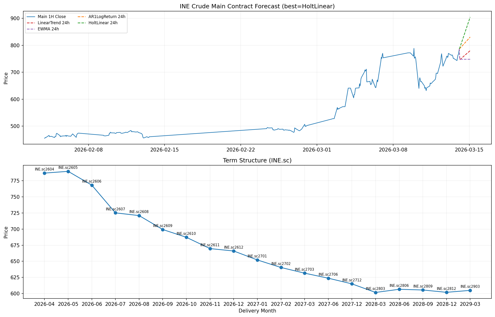

# INE 原油行情看板（TqSdk）

本项目基于天勤量化 `tqsdk` 读取 INE 原油期货（`sc`）行情，并生成网页看板，包含：

- 当前主连价格、开盘价
- 各合约增减仓（手）与增减仓 x 合约乘数（桶）
- 期限结构（按交割月）
- 主连 1 小时行情图
- 多模型 24 小时预测与误差对比

## 效果预览



## 项目文件

- `ine_crude_dashboard.py`：抓取行情、计算指标、运行多模型预测、生成 HTML
- `ine_crude_dashboard.html`：程序输出的网页报告
- `docs/dashboard_preview.png`：README 展示用预览图

## 安装依赖

```bash
pip install tqsdk pandas numpy plotly flask matplotlib
```

## 运行方式

```bash
python ine_crude_dashboard.py --user <天勤账号> --password <天勤密码>
```

可选参数：

- `--output`：输出 HTML 文件路径（默认 `ine_crude_dashboard.html`）

## 最新一次结果快照（示例）

数据时间：`2026-03-16 00:06:44 +08:00`  
主连标的：`INE.sc2604`

### 行情与持仓概览

| 项目 | 数值 |
|---|---|
| 主连现价 | 786.80 |
| 主连开盘价 | 728.30 |
| 增仓最明显合约 | INE.sc2605，+5,232 手（+5,232,000 桶） |
| 减仓最明显合约 | INE.sc2604，-6,638 手（-6,638,000 桶） |
| 最佳预测模型 | HoltLinear |

### 多模型对比（验证集 + 24h 预测）

| 模型 | MAE | RMSE | 24h 预测价 | 95% 区间 |
|---|---:|---:|---:|---|
| LinearTrend | 37.293 | 40.230 | 779.99 | [747.21, 812.77] |
| EWMA | 73.349 | 76.396 | 747.99 | [706.12, 789.86] |
| AR1LogReturn | 38.298 | 41.355 | 830.40 | [797.69, 863.12] |
| HoltLinear | 26.222 | 32.512 | 904.34 | [847.15, 961.52] |

说明：上表为一次运行样例，实时行情变化后数值会更新。

## 预测方法说明

程序并行使用 4 种方法进行预测，并在网页中同时展示：

1. `LinearTrend`：线性趋势回归外推
2. `EWMA`：指数加权均值水平预测
3. `AR1LogReturn`：对数收益率 AR(1) 后还原价格路径
4. `HoltLinear`：Holt 双指数平滑

模型选择规则：

- 使用最近 240 根 1 小时 K 线
- 划分验证集并计算 MAE、RMSE
- 以 MAE 最小模型作为“最佳模型”

## 注意事项

- 主图使用 `KQ.m@INE.sc`（主连），换月时可能出现价格跳变，属于主连机制特性。
- 预测仅用于研究与演示，不构成投资建议。

