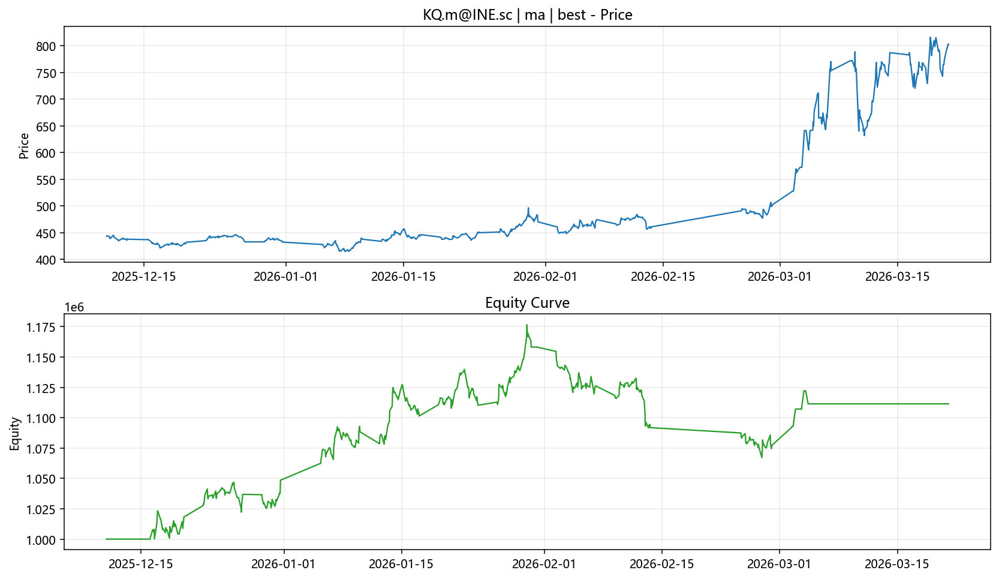

# Backtest Report (ma)

- Time: `2026-03-23 01:02:20 CST`
- Symbol: `KQ.m@INE.sc`

## Parameters

- `fast_ma`: `10`
- `slow_ma`: `40`
- `breakout_window`: `20`
- `atr_window`: `14`
- `stop_atr`: `1.5`
- `rr`: `1.5`
- `risk_per_trade`: `0.01`

## Metrics

| Metric | Value |
|---|---:|
| Trades | 82 |
| Win Rate | 46.34% |
| Payoff Ratio | 1.537 |
| Profit Factor | 1.328 |
| Max Drawdown | -9.29% |
| Total Return | 11.14% |
| Annual Return (est.) | 276.45% |
| Sharpe (est.) | 4.773 |

## Files

- Chart: `ma_KQ_m_INE_sc_best_chart.png`
- Trades: `ma_KQ_m_INE_sc_best_trades.csv`
- Equity: `ma_KQ_m_INE_sc_best_equity.csv`

> Research only, not investment advice.