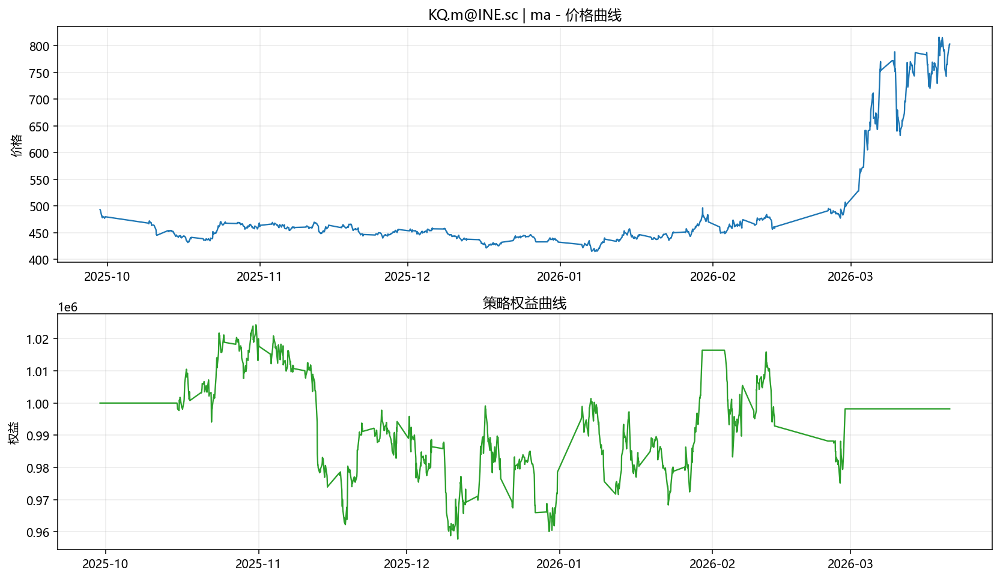

# 交易系统回测报告（ma）

- 时间：`2026-03-23 00:50:27 CST`
- 标的：`KQ.m@INE.sc`

## 核心量化指标

| 指标 | 数值 |
|---|---:|
| 交易次数 | 75 |
| 胜率 | 34.67% |
| 赔率（平均盈利/平均亏损） | 1.886 |
| Profit Factor | 1.000 |
| 最大回撤 | -6.50% |
| 总收益率 | -0.18% |
| 年化收益率（估算） | -1.31% |
| 夏普比（估算） | 0.058 |

## 交易系统说明

- 开仓：根据策略信号（均线方向或通道突破）开仓。
- 平仓：反向信号、止损、止盈、或样本结束强平。
- 资金管理：每笔风险按权益固定比例，基于 ATR 计算仓位。
- 风控：单笔止损、收益风险比止盈、保证金占用上限、最大手数限制。

## 输出文件

- 图表：`ma_KQ_m_INE_sc_chart.png`
- 交易明细：`ma_KQ_m_INE_sc_trades.csv`
- 权益曲线：`ma_KQ_m_INE_sc_equity.csv`

> 说明：结果用于研究，不构成投资建议。