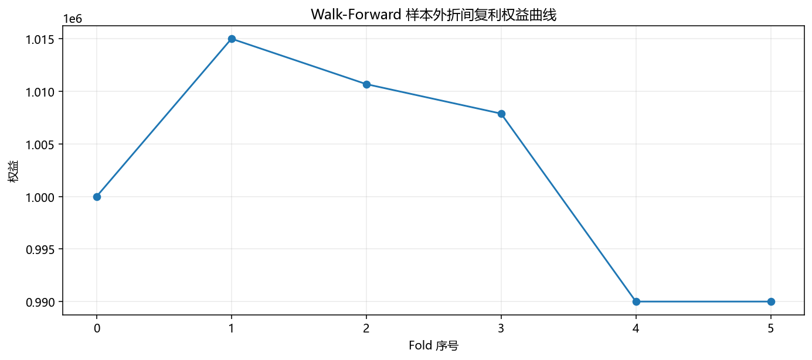

# Walk-Forward 样本外验证报告（ma）

- 标的：`KQ.m@INE.sc`
- 折数：`5`

## 总结指标

| 指标 | 数值 |
|---|---:|
| 样本外胜率（正收益折占比） | 20.00% |
| 样本外平均收益率（每折） | -0.20% |
| 样本外中位收益率（每折） | -0.28% |
| 样本内平均收益率（每折） | 1.21% |
| 样本内平均夏普 | 2.197 |
| 样本外平均夏普 | -2.347 |
| 收益缺口（样内-样外） | 1.41% |
| 夏普缺口（样内-样外） | 4.544 |
| 样本外复利总收益 | -1.00% |
| 折间权益最大回撤 | -2.46% |

## 过拟合判断参考

- 若样内显著好于样外（收益缺口/夏普缺口过大），可能存在过拟合。
- 若样外正收益折占比偏低（例如低于50%），策略鲁棒性偏弱。
- 建议结合不同市场阶段、不同品种、不同交易成本再做稳健性验证。

## 输出文件

- 每折结果：`wf_ma_KQ_m_INE_sc_folds.csv`
- 折间权益图：`wf_ma_KQ_m_INE_sc_oos_equity.png`

## 每折结果预览（前10行）

| fold_id | train_start | train_end | test_start | test_end | best_params | is_trades | is_win_rate | is_total_return | is_sharpe | is_max_dd | oos_trades | oos_win_rate | oos_total_return | oos_sharpe | oos_max_dd |
|---|---|---|---|---|---|---|---|---|---|---|---|---|---|---|---|
| 1 | 2025-11-03 09:00:00+08:00 | 2025-12-17 23:00:00+08:00 | 2025-12-18 00:00:00+08:00 | 2026-01-06 10:00:00+08:00 | {'fast_ma': 10, 'slow_ma': 40, 'breakout_window': 20, 'atr_window': 14, 'stop_atr': 1.5, 'rr': 1.5, 'risk_per_trade': 0.005} | 45 | 0.4 | -0.002919285714286568 | -0.39857231555254174 | -0.028349894330948144 | 11 | 0.6363636363636364 | 0.014989285714285483 | 9.935537917933031 | -0.01155373828039341 |
| 2 | 2025-11-18 02:00:00+08:00 | 2026-01-06 10:00:00+08:00 | 2026-01-06 11:00:00+08:00 | 2026-01-21 09:00:00+08:00 | {'fast_ma': 10, 'slow_ma': 40, 'breakout_window': 20, 'atr_window': 14, 'stop_atr': 1.5, 'rr': 1.5, 'risk_per_trade': 0.005} | 42 | 0.5238095238095238 | 0.030011785714284533 | 5.251142207480104 | -0.019100492277438152 | 8 | 0.375 | -0.004253928571428589 | -2.784215959919726 | -0.012455714285714237 |
| 3 | 2025-12-03 01:00:00+08:00 | 2026-01-21 09:00:00+08:00 | 2026-01-21 10:00:00+08:00 | 2026-02-05 02:00:00+08:00 | {'fast_ma': 10, 'slow_ma': 40, 'breakout_window': 20, 'atr_window': 14, 'stop_atr': 1.5, 'rr': 1.5, 'risk_per_trade': 0.005} | 45 | 0.5111111111111111 | 0.026891428571427678 | 4.795058095059252 | -0.02802619526636907 | 3 | 0.3333333333333333 | -0.0027717857142857127 | -3.8600054990893398 | -0.005036428571428497 |
| 4 | 2025-12-18 00:00:00+08:00 | 2026-02-05 02:00:00+08:00 | 2026-02-05 09:00:00+08:00 | 2026-03-02 14:00:00+08:00 | {'fast_ma': 10, 'slow_ma': 40, 'breakout_window': 20, 'atr_window': 14, 'stop_atr': 1.5, 'rr': 1.5, 'risk_per_trade': 0.005} | 36 | 0.4722222222222222 | 0.008258571428570782 | 1.6237587402251947 | -0.023547043142071566 | 6 | 0.16666666666666666 | -0.017725714285714456 | -15.02606503762234 | -0.023926569351562454 |
| 5 | 2026-01-06 11:00:00+08:00 | 2026-03-02 14:00:00+08:00 | 2026-03-02 21:00:00+08:00 | 2026-03-17 13:00:00+08:00 | {'fast_ma': 10, 'slow_ma': 40, 'breakout_window': 20, 'atr_window': 14, 'stop_atr': 1.5, 'rr': 2.0, 'risk_per_trade': 0.005} | 22 | 0.36363636363636365 | -0.0017228571428576922 | -0.2856669023363677 | -0.026869793823639188 | 0 | 0.0 | 0.0 | 0.0 | 0.0 |

> 仅供研究，不构成投资建议。