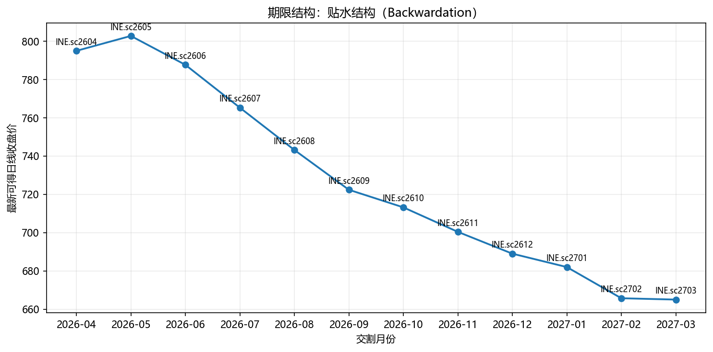

# INE.sc 期限结构分析

- 生成时间：`2026-03-23 00:28:55 CST`
- 结构判断：**贴水结构（Backwardation）**
- 近月 `INE.sc2604` 收盘价：`795.00`
- 远月 `INE.sc2703` 收盘价：`665.00`
- 远近月价差（远-近）：`-130.00`（`-16.35%`）
- 曲线斜率（线性拟合）：`-13.7164`

## 期限结构图

## 合约收盘价表

| symbol | delivery | close | open_interest |
|---|---|---|---|
| INE.sc2604 | 2026-04 | 795.00 | 3,860 |
| INE.sc2605 | 2026-05 | 802.80 | 54,574 |
| INE.sc2606 | 2026-06 | 787.70 | 24,643 |
| INE.sc2607 | 2026-07 | 765.30 | 11,325 |
| INE.sc2608 | 2026-08 | 743.20 | 3,803 |
| INE.sc2609 | 2026-09 | 722.40 | 4,371 |
| INE.sc2610 | 2026-10 | 713.20 | 2,222 |
| INE.sc2611 | 2026-11 | 700.40 | 1,025 |
| INE.sc2612 | 2026-12 | 689.00 | 3,542 |
| INE.sc2701 | 2027-01 | 682.00 | 240 |
| INE.sc2702 | 2027-02 | 665.70 | 175 |
| INE.sc2703 | 2027-03 | 665.00 | 97 |

## 可考虑的交易策略（研究用途）

- 思路A（日历价差回归）：空近月、多远月，博弈贴水收敛。
- 思路B（库存/现货紧张交易）：若近端持续偏强，可配合基本面做近强远弱跟随。
- 风险提示：需关注流动性差异、换月规则、保证金变化、突发供需事件和止损执行。

> 以上策略仅供研究，不构成投资建议。